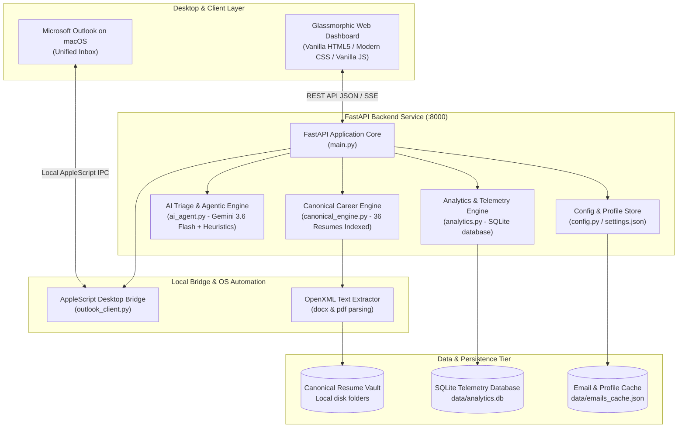

# System Architecture & Technical Design

## Aura Mail AI: Executive Outlook Email Assistant & Canonical Career Co-Pilot

This document outlines the architectural blueprint, security posture, component topology, and technical design decisions for peer review and audit.

---

## 1. Executive Summary & Problem Statement

Senior technology executives and strategic advisors receive high volumes of inbound communications across multiple personal, professional, and advisory email accounts. These emails fall into two opposing categories:
1. **High-Value Executive Reachouts**: Recruiters, venture partners, and prospective enterprise clients offering advisory, solutions architecture, or leadership roles.
2. **Noise & Clutter**: Marketing solicitations, newsletters, automated alerts, and cold B2B vendor spam.

### Architectural Objectives:
- **Universal Multi-Account Triage**: Simultaneously scan unified inboxes across 6 active accounts on macOS without requiring multiple Microsoft Azure app registrations or cloud credentials.
- **Strict Account Boundary Isolation**: Enforce hard filtering to skip historical corporate archive mailboxes (e.g. `dxc.com`, `cdw.com`, `revealwhy.com`).
- **Canonical Career System & Dynamic Role Matching**: Index authoritative resume variants and match each opportunity against a 3-level role taxonomy (Level 3A Advisor, Level 3B Technical Program Manager, Level 3C AI Governance Leader, Field CTO, etc.).
- **Fact-Locked Grounding & Zero Hallucination**: Enforce immutable metric grounding from the verified Accomplishment Ledger (e.g. Influenced $8M Google Cloud revenue, $100M+ enterprise platform revenue delivered, $2.1M CDW closed services, Promevo $2M+ pipeline contribution).
- **Comprehensive Observability & Telemetry**: SQLite-backed audit trails, conversion funnels, compensation benchmarks, and resume variant ROI.

---

## 2. Component Architecture & Topology

---

## 3. Subsystem Deep-Dive

### 3.1 Native macOS Desktop Bridge (`backend/outlook_client.py`)
- **Direct IPC Automation**: Uses macOS `osascript` to directly interrogate Microsoft Outlook's local AppleScript dictionary.
- **Zero-Cloud Tokens**: Completely eliminates the need for Microsoft Azure app registrations, client secrets, device code login tokens, or IMAP app passwords.
- **Dynamic Exclusion Filtering**: Queries all container mailboxes whose name is `"Inbox"`, dynamically excluding historical corporate accounts (`dxc.com`, `cdw.com`, `revealwhy.com`) and local folders (`On My Computer`).
- **Safe Draft Injection**: Injects drafted replies directly into Outlook's Drafts folder with the resolved canonical resume attachment linked via POSIX file descriptors.

### 3.2 Canonical Career Engine (`backend/canonical_engine.py`)
- **OpenXML Engine**: Pure Python OpenXML / zipfile parser that extracts clean text from `.docx` and `.pdf` files without external binary dependencies.
- **Role Taxonomy Matrix**:
  - **Level 3A**: *Advisor / Principal Solutions Architect* (Pre-sales, discovery, enterprise architecture, GTM strategy)
  - **Level 3B**: *Principal Technical Program Manager* (Cross-functional delivery governance, cloud roadmaps)
  - **Level 3C**: *AI Governance & Enterprise Data Leader* (NIST AI RMF, Collibra lineage, data quality, compliance)
  - **Field CTO / Technology Strategist**: (Executive advisory, enterprise transformation)
  - **Principal Data Platform & AI Architect**: (Lakehouse, Databricks, GCP BigQuery, Agentic AI)
- **Scoring & Match Heuristics**: Computes token overlap, lens weights, and role archetype affinity scores (0-100%) to auto-select the highest-converting resume variant.

### 3.3 AI Triage & Fact-Locked Grounding (`backend/ai_agent.py`)
- **Two-Tier Classification Architecture**:
  1. *Sub-millisecond Heuristic Classifier*: Identifies system notifications, transactional receipts, and promotional marketing without consuming LLM API tokens.
  2. *Gemini 3.6 Flash Engine*: Analyzes nuanced candidate reachouts to extract recruiter contact, hiring entity, compensation, and required skills.
- **Strict Grounding Guardrails**:
  - Responses are bounded by verified metrics in `Accomplishment_Ledger_CURRENT.docx`.
  - Prompts strictly forbid metric invention or date modification.
  - Rate-limit circuit breaker (`_GEMINI_COOLDOWN_UNTIL`) provides automatic fallback to local heuristic templates upon 429 quota exhaustion.

### 3.4 Telemetry & Observability Engine (`backend/analytics.py`)
- **Database Engine**: Local SQLite (`data/analytics.db`) with WAL mode enabled.
- **Database Schema**:
  - `opportunities`: Inbound reachout records, company, role title, lens archetype, stated compensation min/max/type, and lifecycle status (`INBOUND` ➔ `MATCHED` ➔ `DRAFTED` ➔ `REPLIED` ➔ `SCHEDULED`).
  - `event_telemetry`: Append-only event stream recording triage events, drafts created, and replies dispatched with millisecond timestamps and confidence scores.
  - `grounding_audit`: Verification log linking each sent reply to the exact accomplishment facts and attached resume file.
  - `system_telemetry`: System health, inbox scan latency, and noise volume metrics.

### 3.5 Glassmorphic Frontend Dashboard (`frontend/`)
- **Technology Stack**: Native HTML5, Vanilla JavaScript (ES2022), and Custom CSS Design System (Glassmorphism, dark palette, CSS variables, micro-animations). Zero framework bloat (No React/Tailwind build steps required).
- **Navigation Structure**:
  1. *Recruiter & Resume Studio*: Inbound reachout list, AI role specs, canonical match badge & score %, fact-locked draft editor, 1-click draft save to Outlook.
  2. *Canonical Resume Vault*: Searchable and filterable grid of 36 local resume variants, lens badges, format chips, and interactive Accomplishment Ledger modal.
  3. *Analytics & Observability Studio*: Opportunity conversion funnel, market compensation benchmarks by lens, resume variant ROI leaderboard, immutable grounding audit stream.
  4. *Noise Cleaner & Triage*: Clutter breakdown and 1-click batch cleanup.
  5. *Candidate Bio & Preferences*: Editable profile attributes, 6 active inboxes, 3 historical exclusion accounts.

---

## 4. Security & Privacy Posture

1. **Local Boundary Isolation**: All email parsing, candidate data storage, and resume indexing occur strictly on the local machine.
2. **Zero Permanent External Storage**: Email bodies are never persisted to external cloud databases.
3. **Safe Review by Default**: The system operates in `SAFE_REVIEW` mode, creating drafts in Outlook for human review rather than autonomously sending unverified emails.
4. **Historical Account Shielding**: Strict exclusion rules guarantee that archived corporate emails from prior employers (`DXC`, `CDW`, `RevealWhy`) are never scanned, modified, or forwarded.

---

## 5. Automated Verification & Quality Assurance

- **Test Suite**: 22 unit tests across `backend/tests/test_analytics.py`, `backend/tests/test_canonical_engine.py`, and `backend/tests/test_assistant.py`.
- **Command**: `PYTHONPATH=. .venv/bin/pytest backend/tests/ -v`
- **Results**: 100% passing across schema validation, compensation parsing, opportunity lifecycles, canonical matching, heuristic classifiers, and REST endpoints.
