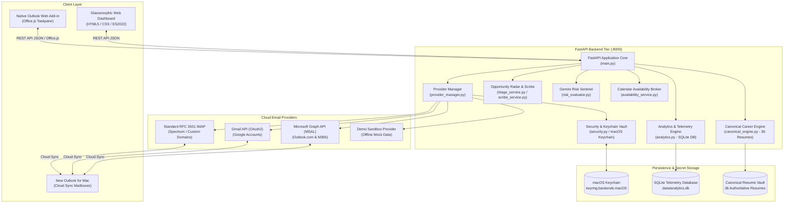

# System Architecture & Technical Design (v1.1)

## Aura Mail AI: Universal Cloud Multi-Account Assistant & Canonical Career Co-Pilot

This document outlines the architectural blueprint, security posture, component topology, and technical design decisions for Aura Mail AI v1.1.

---

## 1. Executive Summary & Core Security Invariants

Senior technology executives and strategic advisors manage multiple inboxes across personal, professional, and advisory email accounts. In v1.0, the application relied on local AppleScript automation against Legacy Microsoft Outlook for Mac. 

In **v1.1**, Aura Mail AI transitions to a **cloud-first, multi-account architecture** compatible with **New Outlook for Mac**, web email, and mobile clients:
1. **Cloud Synchronization**: Messages and drafts created in the cloud synchronize automatically into New Outlook for Mac, Gmail, and mobile apps.
2. **Provider-Neutral Interface**: Abstract `BaseEmailProvider` implemented by `MicrosoftGraphProvider` (MSAL), `GmailProvider`, `ImapProvider`, and `DemoProvider`.
3. **Structured Composite Message Identity**: Every message ID carries its positive provider and account identity (`provider:account_id:native_id`), eliminating prefix guessing.
4. **macOS Keychain Vault**: Secrets (Gemini keys, OAuth refresh tokens, IMAP passwords) are stored exclusively in macOS Keychain via Python `keyring`.
5. **Zero Direct Transmission Authority & Native Send Safety**:
   - Invariant: `ANY AURA-CONTROLLED EXECUTION -> DIRECT MAIL TRANSMISSION FORBIDDEN`.
   - **`DRAFT_ONLY`**: Direct mail transmission by Aura is forbidden. Aura generates, triages, and stages drafts locally or in cloud drafts.
   - **`MANUAL_SEND_ONLY`**: Direct mail transmission by Aura is also forbidden. Aura prepares and stages drafts; final outbound transmission is executed exclusively by the human operator through their native mail client (Outlook / Gmail / Webmail).
   - Aura's application routes contain zero outbound mail transmission endpoints (`send_reply` fails closed with `SEND_FORBIDDEN`).
6. **Local Desktop Browser Boundary & Threat Model**: Multi-layered defense-in-depth formalizing loopback socket peer enforcement, exact loopback Host allowlisting, immutable canonical HTTPS CORS (`https://localhost:8000`), server-side Origin/Fetch Metadata verification, and purpose-bound, single-use, expiring OAuth state transactions (see [THREAT_MODEL.md](file:///Users/briankinlaw/aura-mail-ai/THREAT_MODEL.md)).

---

## 2. Component Architecture & Topology

---

## 3. Subsystem Deep-Dive

### 3.1 Cloud Provider Architecture (`backend/providers/`)

#### Provider Scope & Capability Truth Table

| Provider | Explicit Aura Scope Configuration | Provider Technical Capability | Aura Exposed Application Capability | Aura Policy Authorization |
| :--- | :--- | :--- | :--- | :--- |
| **Microsoft Graph** | `User.Read`, `Mail.ReadWrite` | Read/write mail, create drafts, manage folders (`Mail.Send` omitted) | Read inbox, compose/stage drafts, upload attachments, manage folders | Staging and inbox reading only; direct mail transmission forbidden |
| **Gmail API** | `https://www.googleapis.com/auth/gmail.modify` | Read/write mail, create drafts, modify labels (Token technically permits broader provider actions) | Read inbox, compose/stage MIME drafts, label quarantine/trash | Staging and inbox reading only; direct mail transmission forbidden |
| **RFC 3501 IMAP** | User-configured mailbox credentials | Read/append/delete mailbox messages | Read inbox, append MIME drafts directly to Drafts folder | Staging and inbox reading only; direct mail transmission forbidden |
| **Demo Provider** | None (in-memory mock data) | Isolated mock generation | Offline sandbox triage and draft simulation | Sandboxed simulation; transmission impossible |

#### Provider Contract Invariants
- **Abstract Base Contract** (`base.py`):
  - Declares `authenticate()`, `validate_connection()`, `list_accounts()`, `fetch_inbox_messages()`, `create_reply_draft()`, `attach_file()`, `move_message()`, `delete_message()`.
  - Fail-closed `send_reply()`: Provider base class implements a permanent fail-closed boundary returning `success=False` and `error_code="SEND_FORBIDDEN"`. Aura contains zero direct transmission routes.
  - Every operation returns a structured `ProviderOperationResult` with `success`, `provider`, `account_id`, `operation`, `remote_object_id`, `error_code`, `safe_message`, and `retryable`.

### 3.2 Security & macOS Keychain Vault (`backend/security.py`, `backend/auth.py`)

- **Zero Plaintext Secrets on Disk**:
  - `data/settings.json` contains only non-secret user preferences.
  - API keys, OAuth tokens, and mailbox passwords are stored in **macOS Keychain** (`keyring.backends.macOS.Keyring`).
- **Startup Security Audit**: Automatically scans code and configuration files on startup and flags unmasked keys.
- **Localhost Trust Model & Scope of Protection**:
  - The local session token (`~/.aura_session_token`) binds expected browser and Office.js add-in interactions to protect against remote web origins and cross-origin browser requests (`Sec-Fetch-Site: cross-site` rejection).
  - The session token is **not** an operating-system isolation boundary against arbitrary same-user local processes running under the same `$UID`.
  - CORS is a browser-origin enforcement mechanism (`allow_origins = ["https://localhost:8000"]`), not caller authentication or OS-level security isolation.
- **Offline Recovery Authority**:
  - Administrative provenance store recovery is strictly an offline maintenance operation executed via CLI (`scripts/aura-recover-provenance`) with terminal/TTY requirements and runtime lock verification; no recovery endpoint exists in the running FastAPI HTTP server.

### 3.3 Provider Manager & Dispatcher (`backend/provider_manager.py`)
- Dispatches operations according to composite message IDs (`provider:account_id:native_id`).
- Merges multi-account inboxes into a unified view.
- Excludes historical reference accounts (`bkinlaw@dxc.com`, `brian.kinlaw@cdw.com`, `briankinlaw@revealwhy.com`).
- Updates cache and telemetry ONLY on confirmed provider success (`remote_object_id`).

### 3.4 Canonical Career Engine (`backend/canonical_engine.py`)
- Indexes 36 canonical and custom resume files on disk using pure OpenXML.
- Matches job reachouts against the 3-level role taxonomy (Level 3A Advisor, Level 3B TPM, Level 3C AI Governance, Field CTO).
- Enforces strict factual grounding from `Accomplishment_Ledger_CURRENT.docx` ($8M Google Cloud revenue influenced, $100M+ enterprise platform revenue delivered, Promevo pipeline $2M+).
- Operates as an **information-integrity control**, binding model generation to verified accomplishment evidence and reducing unsupported generation risk.

### 3.5 Gemini Risk Sentinel Architecture (`backend/radar/risk_evaluator.py`)
- **Monotonic Security Floor**: `FINAL_RISK >= DETERMINISTIC_RISK`.
- **Gemini Downgrade Prohibition**: Model/LLM analysis may add risk context or elevate severity, but cannot downgrade deterministic security findings below the heuristic baseline floor.
- **Universal Upward Normalization**: Contradictory signals (e.g. low textual label paired with high-risk heuristic evidence) resolve upward to the strongest valid security rank. Normalization does not fabricate evidence.
- **Decision Verdict**: `SAFE` / `PROCEED` indicates the evaluated content satisfied the Risk Sentinel decision process for the exact evaluated draft; it never acts as mail transmission authorization.
- **Exact-Draft Correlation & Fail-Closed Lifecycle**: `VERIFIED SAFE` applies only to a current, successfully completed, structurally valid audit correlated to the exact evaluated draft hash. Stale, failed, malformed, mismatched, or otherwise invalid audit responses fail closed and cannot retain or confer `VERIFIED SAFE` status. Manual edits or regeneration mark prior audits as `STALE` and fail closed until re-evaluated.

### 3.6 Calendar Availability Broker (`backend/calendar_broker/`)
- **Proposed vs Verified Availability**: Distinguishes proposed time slots from trusted provider-verified availability.
- **Trusted Provider Provenance**: Verified availability (`CALENDAR_VERIFIED_CLEAR`, `CALENDAR_VERIFIED_WITH_CONFLICTS`) requires server-side `TrustedCalendarEvidence` from actual provider execution.
- **Rejection of Untrusted Assertions**: Caller-supplied metadata or unqueried requests strictly remain `CALENDAR_NOT_CHECKED`.

### 3.7 Native Microsoft Outlook Web Add-in (`frontend/add-in/`)
- **HTTPS Localhost Requirement**: Embedded Office.js taskpane requires trusted HTTPS origin (`https://localhost:8000`).
- **Message Resolution**: Resolves message context using composite message IDs.
- **Cloud Draft Staging**: Creates provider drafts via `POST /api/emails/{id}/save-draft`; requires provider-confirmed `remote_object_id` before reporting success.
- **Untrusted Generated Content Escaping**: Model-generated and user-supplied reply text is treated as untrusted content and HTML-escaped at the rendering boundary (`formatReplyAsSafeHtml`) before injection into Outlook.
- **Native Send Boundary**: Aura drafts and stages; final mail transmission is executed exclusively by the user via Outlook's native Send button.

---

## 4. Automated Verification & Quality Assurance

- **Unit & Security Integration Tests**: Comprehensive automated test suite in `backend/tests/` covering safety policy, origin defense, trust boundaries, multi-account routing, providers, risk evaluation, and factual grounding.
- **Test Runner**: `.venv/bin/python -m pytest`
- **Frontend Test Suites**: Node 24 test runners for Outlook Content Security (`48/48`), Cloud-Draft Staging (`52/52`), and Risk Validator (`17/17`).
- **Compilation**: `.venv/bin/python -m compileall backend scripts` (0 errors).
