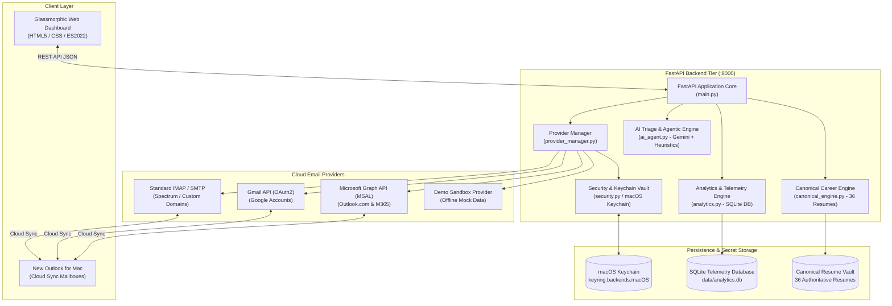

# System Architecture & Technical Design (v1.1)

## Aura Mail AI: Universal Cloud Multi-Account Assistant & Canonical Career Co-Pilot

This document outlines the architectural blueprint, security posture, component topology, and technical design decisions for Aura Mail AI v1.1.

---

## 1. Executive Summary & Problem Statement

Senior technology executives and strategic advisors manage multiple inboxes across personal, professional, and advisory email accounts. In v1.0, the application relied on local AppleScript automation against Legacy Microsoft Outlook for Mac. 

In **v1.1**, Aura Mail AI transitions to a **cloud-first, multi-account architecture** compatible with **New Outlook for Mac**, web email, and mobile clients:
1. **Cloud Synchronization**: Messages and drafts created in the cloud synchronize automatically into New Outlook for Mac.
2. **Provider-Neutral Interface**: Abstract `BaseEmailProvider` implemented by `MicrosoftGraphProvider` (MSAL), `GmailProvider`, `ImapProvider`, and `DemoProvider`.
3. **Structured Composite Message Identity**: Every message ID carries its positive provider and account identity (`provider:account_id:native_id`), eliminating prefix guessing.
4. **macOS Keychain Vault**: Secrets (Gemini keys, OAuth refresh tokens, IMAP passwords) are stored exclusively in macOS Keychain via Python `keyring`.
5. **Truthful Error Reporting & Safety**: Strict `SAFE_REVIEW` mode; no autonomous sending or deletion without confirmation; no false positive success; no silent sample email fallback on error.

---

## 2. Component Architecture & Topology

---

## 3. Subsystem Deep-Dive

### 3.1 Cloud Provider Architecture (`backend/providers/`)
- **Abstract Base Contract** (`base.py`):
  - `authenticate()`, `validate_connection()`, `list_accounts()`, `fetch_inbox_messages()`, `create_reply_draft()`, `attach_file()`, `send_reply()`, `move_message()`, `delete_message()`.
  - Every operation returns a structured `ProviderOperationResult` with `success`, `provider`, `account_id`, `operation`, `remote_object_id`, `error_code`, `safe_message`, `retryable`.
- **Microsoft Graph Provider** (`graph.py`):
  - Integrates `msal.PublicClientApplication` with serialized token cache in macOS Keychain.
  - Supports multi-mailbox accounts and automatic alias resolution.
  - Implements Graph pagination (`@odata.nextLink`) and requests least-privilege scopes (`Mail.ReadWrite`, `Mail.Send`, `User.Read`, `offline_access`).
  - Creates threaded drafts via `POST /me/messages/{id}/createReply` and validates attachment upload separately.
- **Gmail Provider** (`gmail.py`):
  - Dedicated Google OAuth2 integration with Keychain token storage.
  - Composes MIME multipart in-reply-to drafts and handles label-based quarantine.
- **Generic IMAP / SMTP Provider** (`imap.py`):
  - Implements RFC 6154 Special-Use folder discovery (`\Drafts`, `\Sent`, `\Trash`, `\Junk`).
  - Uses IMAP UID commands (`UID SEARCH`, `UID FETCH`, `UID COPY`, `UID STORE`) to guarantee UID validity.
- **Explicit Demo Mode Provider** (`demo.py`):
  - Isolated offline mock sandbox activated only when `demo_mode=True`.

### 3.2 Security & macOS Keychain Vault (`backend/security.py`)
- **Zero Plaintext Secrets on Disk**:
  - `data/settings.json` contains only non-secret user preferences.
  - API keys, OAuth tokens, and mailbox passwords are stored in **macOS Keychain** (`keyring.backends.macOS.Keyring`).
- **Startup Security Audit**: Automatically scans code and configuration files on startup and flags unmasked keys.

### 3.3 Provider Manager & Dispatcher (`backend/provider_manager.py`)
- Dispatches operations according to composite message IDs (`provider:account_id:native_id`).
- Merges multi-account inboxes into a unified view.
- Excludes historical reference accounts (`bkinlaw@dxc.com`, `brian.kinlaw@cdw.com`, `briankinlaw@revealwhy.com`).
- Updates cache and telemetry ONLY on confirmed provider success.

### 3.4 Canonical Career Engine (`backend/canonical_engine.py`)
- Indexes 36 canonical and custom resume files on disk using pure OpenXML.
- Matches job reachouts against the 3-level role taxonomy (Level 3A Advisor, Level 3B TPM, Level 3C AI Governance, Field CTO).
- Enforces strict factual grounding from `Accomplishment_Ledger_CURRENT.docx` ($8M Google Cloud revenue influenced, $100M+ enterprise platform revenue delivered, Promevo pipeline $2M+).

---

## 4. Automated Verification & Quality Assurance

- **Unit & Integration Mock Tests**: 38 tests in `backend/tests/` covering providers, multi-account merge, alias deduplication, error handling, partial failure, rate limits (429), and secret sanitization.
- **Test Command**: `PYTHONPATH=. .venv/bin/pytest backend/tests/ -v`
- **Result**: `38 passed` with 100% success.
